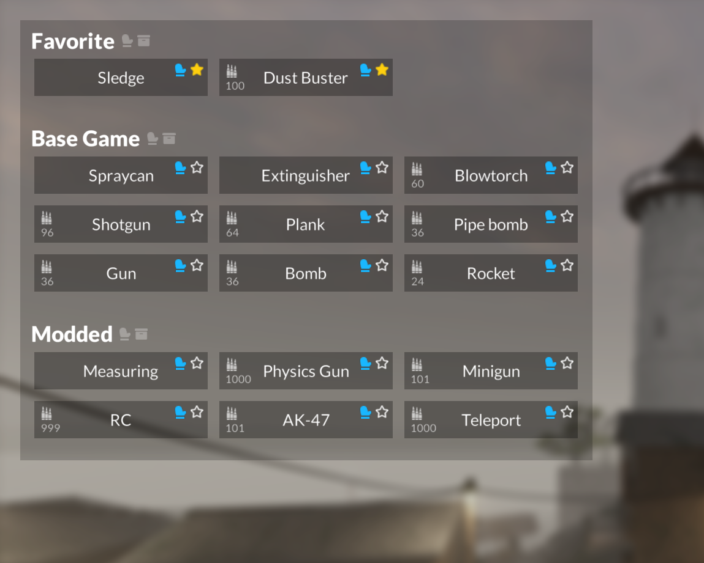

# Tool Menu for Teardown

A mod for Teardown that lets you easily switch tools

## Features

- Open a menu to equip any base game or modded tool
- Favorite tools to easily find them at the top of the menu
- Add or remove tools from your toolbelt (individually or in bulk)

## Screenshot

## Installation

Copy the `Tool Menu` folder and all of its contents into your mods folder. The mod folder is usually located in your documents folder under `Teardown/Mods/`.
